# Sahara — a private place to be heard

**Agents League Hackathon 2026 · Track: Reasoning Agents (Microsoft Foundry) · IQ Layer: Foundry IQ**
*Candidate for: Best Reasoning Agent · Best Use of IQ Tools · Hack for Good Award*

> Sahara ("support" in Hindi) is a disguised, trauma-informed AI agent that gives domestic violence survivors in India an instant, safe, *legally grounded* response the moment they describe what happened to them — and quietly builds the dated evidence record that courts and Protection Officers need.

---

## The problem

NFHS-5 data shows roughly **1 in 3 married women in India experience spousal violence — yet the vast majority never report it**. The barriers are fear of being discovered, not knowing their legal rights, and the feeling that nothing will happen even if they speak up. Helplines exist (181, One Stop Centres, free legal aid through DLSA), but awareness is low and the first step feels enormous.

The most dangerous moment for a survivor is when her abuser discovers she is seeking help. Any tool for this population must be **invisible, instant, and trustworthy** — including legally trustworthy. A hallucinated legal "right" could send a woman into a police station with false expectations. That is why grounding is not a feature here; it is a safety requirement.

## What Sahara does

1. **She opens what looks like an ordinary calculator.** A code unlocks the real app. `Esc` or one tap flips back instantly (quick exit).
2. **She describes the incident in her own words** — English, Hindi, or Marathi.
3. **The Sahara agent reasons in three explicit steps:**
   - **Triage** — assesses risk using established lethality indicators (strangulation, threats to kill, weapons, violence during pregnancy, escalation).
   - **Retrieve** — queries a **Foundry IQ knowledge base** containing the *actual text* of the Protection of Women from Domestic Violence Act 2005, relevant Bharatiya Nyaya Sanhita sections, the One Stop Centre (Sakhi) directory, and helpline/safety-planning guides. Agentic retrieval decomposes the question into parallel subqueries, semantically reranks, and returns **cited passages**.
   - **Respond** — composes a warm, trauma-informed answer: validation first, then her *cited* legal rights, then practical next steps that keep every decision in her hands. If retrieval finds nothing, the agent does not guess — it routes her to the **181 Women Helpline** (the safe failure mode).
4. **Every incident is saved as a timestamped private record** — building the documented pattern of abuse that PWDVA proceedings rely on. She can delete anything, anytime. Nothing is stored on her device.
5. **If immediate danger is detected**, an urgent banner surfaces **112 / 181** above everything else.

## Architecture

```mermaid
flowchart LR
    subgraph Device["Survivor's phone / browser"]
        CALC["Calculator disguise<br/>(unlock code + quick exit)"] --> UI["Sahara React app"]
    end

    UI -->|"incident text (anonymous)"| API["FastAPI proxy<br/>(server.py)"]

    subgraph Foundry["Microsoft Foundry"]
        API -->|"Responses API +<br/>agent_reference"| AGENT["Sahara Agent<br/>(Foundry Agent Service)<br/>triage → retrieve → respond"]
        AGENT <-->|"MCP: knowledge_base_retrieve"| KB["Foundry IQ knowledge base<br/>(Azure AI Search agentic retrieval)"]
    end

    subgraph Corpus["Azure Blob Storage corpus"]
        PWDVA["PWDVA 2005 full text"]
        BNS["BNS sections"]
        OSC["One Stop Centre directory"]
        SAFE["Helplines & safety planning"]
    end

    KB --- Corpus
    AGENT -->|"JSON: acknowledgment, risk,<br/>cited rights, next steps"| API --> UI
```



**Why Foundry IQ is central, not bolted on:** the knowledge base's agentic retrieval plans subqueries, runs them in parallel, semantically reranks, and returns extractive passages **with citations** — so every legal statement Sahara makes traces back to the statute itself. The agent's instructions forbid answering legal questions from model memory.

## Demo link:
https://youtu.be/uUfwN1MZEcc
## Repository layout

```
sahara-hackathon/
├── README.md                  ← you are here
├── LICENSE                    ← MIT
├── corpus/                    ← what grounds the agent (Foundry IQ sources)
│   ├── legal-rights-and-safety-planning.md
│   └── helplines-and-services-india.md
│   (upload these + the official PWDVA 2005 PDF from indiacode.nic.in)
├── infra/
│   └── search.bicep           ← Azure AI Search service (semantic ranker enabled)
├── agent/
│   ├── setup_agent.py         ← creates the Sahara agent + Foundry IQ MCP tool
│   ├── create_kb_connection.py← creates the managed-identity KB connection
│   ├── server.py              ← FastAPI proxy the app frontend calls
│   └── whatsapp_bot.py        ← WhatsApp Cloud API webhook → same agent (roadmap)
└── frontend/
    ├── App.jsx                ← React app (calculator disguise, talk, records, help)
    ├── sahara.css             ← styles (no Tailwind needed)
    └── main.jsx               ← Vite entry point
```

**One agent, two front doors.** The disguised app serves women who need ongoing
stealth and an evidence journal; a WhatsApp channel (roadmap) would serve instant
first contact with zero install. Both call the *same* Foundry agent, so the
safety principle — grounded or silent — never changes between channels.

## Setup

### 0. Prerequisites
- Azure subscription with a **Microsoft Foundry project** and a deployed chat model (`gpt-4.1-mini`, Global Standard)
- **Azure AI Search** in a region supporting semantic ranker + agentic retrieval (this build uses **Central India**; South India does **not** support it)
- Python 3.10+, Node 18+
- `az login` with access to the project (everything authenticates via `DefaultAzureCredential` / managed identity — no API keys in code)

### 1. Build the knowledge base (Foundry IQ)
1. Create an Azure Blob Storage container and upload the corpus: the official **PWDVA 2005** PDF (indiacode.nic.in) plus the two markdown guides in `/corpus`.
2. Create the search service (`infra/search.bicep` enables semantic ranker at creation, or use the portal — set Semantic ranker to **Free**).
3. In the portal: create a **knowledge source** over the container, then a **knowledge base** named `sahara-law-kb`, and attach a chat-completion model deployment. Wait for the source to show **Active** before querying.
4. On the search service: **Settings → Keys → API access control = Both**, and under **Access control (IAM)** assign **Search Index Data Reader** to the Foundry **project's managed identity** (enable the project's system-assigned identity first).

### 2. Configure environment
Create `.env` in the repo root (git-ignored — never commit it):
```
PROJECT_ENDPOINT=https://<resource>.services.ai.azure.com/api/projects/<project>
PROJECT_RESOURCE_ID=/subscriptions/.../projects/<project>   # Azure portal → project → JSON View → "id"
SEARCH_ENDPOINT=https://<search-name>.search.windows.net    # no trailing slash
KB_NAME=sahara-law-kb
KB_CONNECTION_NAME=sahara-kb-mcp
PROJECT_CONNECTION_NAME=sahara-kb-mcp
AGENT_MODEL=gpt-4.1-mini
AGENT_NAME=sahara-agent
```

### 3. Create the KB connection and the agent
```bash
pip install azure-ai-projects azure-identity python-dotenv requests fastapi uvicorn openai
az login

python agent/create_kb_connection.py   # managed-identity connection to the KB's MCP endpoint
python agent/setup_agent.py             # the agent, wired to that connection
```
> **Why managed identity, not an API key:** the Foundry IQ knowledge base MCP
> tool rejects key-based auth (401). The connection must be a `RemoteTool`
> connection with `ProjectManagedIdentity`, and the project's identity needs
> the **Search Index Data Reader** role on the search service. This was the
> single biggest gotcha in building Sahara — documented here so others skip the pain.

### 4. Run the backend proxy
```bash
python -m uvicorn agent.server:app --reload --port 8000
```
Check `http://127.0.0.1:8000/healthz` → `{"ok": true, "agent": "sahara-agent"}`.
> Use `python -m uvicorn` (not bare `uvicorn`) so it runs inside the venv where the dependencies live.

### 5. Run the frontend
Put `App.jsx`, `sahara.css`, and `main.jsx` into a Vite React app's `src/`:
```bash
npm create vite@latest sahara-app -- --template react
cd sahara-app && npm install
# replace src/App.jsx, src/main.jsx; add src/sahara.css
npm run dev
```
No Tailwind required — `sahara.css` defines the utility classes. `API_BASE` in `App.jsx` defaults to `http://localhost:8000`. Open the printed URL (e.g. `http://localhost:5173`), and **unlock the calculator by typing `1234` then `=`**.

### Quick end-to-end test (no frontend needed)
```bash
curl -X POST http://localhost:8000/api/incident \
  -H "Content-Type: application/json" \
  -d '{"text": "He hit me and locked me out of the house last night", "language": "English"}'
```
Expect JSON with a `risk_level` and `rights` carrying citations like `PWDVA 2005, s.17`.

## Safety design decisions (read before judging the demo)

- **No real survivor data anywhere.** All demo scenarios are fictional, in line with the hackathon disclaimer on confidential information.
- **The agent never auto-reports.** Taking control away from a survivor repeats the abuse dynamic; Sahara informs and connects, she decides.
- **Grounded or silent on law.** Legal claims must carry a knowledge base citation; otherwise the agent says it doesn't know and offers the 181 helpline.
- **Sahara is not an emergency service** and says so persistently. In immediate danger: **112**.
- A production deployment would add: counselor-in-the-loop escalation with a partner NGO, DPDP Act-compliant data handling, penetration testing of the disguise, and regional-language voice input.


## Builder

Built solo by **Shivakumar Erangala** for the Agents League Hackathon 2026,
with AI-assisted development.

Pilot conversations are *planned* with contacts at the Telangana State
Commission for Women to guide what "safe and useful" means in practice — see
the roadmap. Sahara is a working prototype and is deliberately **not deployed
to real survivors**: responsible rollout requires safety red-teaming, expert
review of the triage logic, hardened privacy, and counselor-in-the-loop
escalation through a partner organisation first.

## License

MIT — see [LICENSE](LICENSE). © 2026 Shivakumar Erangala.

