# Sahara — a private place to be heard

**Agents League Hackathon 2026 · Track: Reasoning Agents (Microsoft Foundry) · IQ Layer: Foundry IQ**
*Candidate for: Best Reasoning Agent · Best Use of IQ Tools · Hack for Good Award*

> Sahara ("support" in Hindi) is a disguised, trauma-informed AI agent that gives domestic violence survivors in India an instant, safe, *legally grounded* response the moment they describe what happened to them — and quietly builds the dated evidence record that courts and Protection Officers need.

---

## The problem

NFHS-5 data shows roughly **1 in 3 married women in India experience spousal violence — yet the vast majority never report it**. The barriers are fear of being discovered, not knowing their legal rights, and the feeling that nothing will happen even if they speak up. Helplines exist (181, One Stop Centres, free legal aid through DLSA), but awareness is low and the first step feels enormous.

The most dangerous moment for a survivor is when her abuser discovers she is seeking help. Any tool for this population must be **invisible, instant, and trustworthy** — including legally trustworthy. A hallucinated legal "right" could send a woman into a police station with false expectations. That is why grounding is not a feature here; it is a safety requirement.

## What Sahara does

1. **She opens what looks like an ordinary calculator.** A code unlocks the real app. `Esc` or one tap flips back instantly (quick exit).
2. **She describes the incident in her own words** — English, Hindi, or Marathi.
3. **The Sahara agent reasons in three explicit steps:**
   - **Triage** — assesses risk using established lethality indicators (strangulation, threats to kill, weapons, violence during pregnancy, escalation).
   - **Retrieve** — queries a **Foundry IQ knowledge base** containing the *actual text* of the Protection of Women from Domestic Violence Act 2005, relevant Bharatiya Nyaya Sanhita sections, the One Stop Centre (Sakhi) directory, and helpline/safety-planning guides. Agentic retrieval decomposes the question into parallel subqueries, semantically reranks, and returns **cited passages**.
   - **Respond** — composes a warm, trauma-informed answer: validation first, then her *cited* legal rights, then practical next steps that keep every decision in her hands. If retrieval finds nothing, the agent does not guess — it routes her to the **181 Women Helpline** (the safe failure mode).
4. **Every incident is saved as a timestamped private record** — building the documented pattern of abuse that PWDVA proceedings rely on. She can delete anything, anytime. Nothing is stored on her device.
5. **If immediate danger is detected**, an urgent banner surfaces **112 / 181** above everything else.

## Architecture

```mermaid
flowchart LR
    subgraph Device["Survivor's phone / browser"]
        CALC["Calculator disguise<br/>(unlock code + quick exit)"] --> UI["Sahara React app"]
    end

    UI -->|"incident text (anonymous)"| API["FastAPI proxy<br/>(server.py)"]

    subgraph Foundry["Microsoft Foundry"]
        API -->|"Responses API +<br/>agent_reference"| AGENT["Sahara Agent<br/>(Foundry Agent Service)<br/>triage → retrieve → respond"]
        AGENT <-->|"MCP: knowledge_base_retrieve"| KB["Foundry IQ knowledge base<br/>(Azure AI Search agentic retrieval)"]
    end

    subgraph Corpus["Azure Blob Storage corpus"]
        PWDVA["PWDVA 2005 full text"]
        BNS["BNS sections"]
        OSC["One Stop Centre directory"]
        SAFE["Helplines & safety planning"]
    end

    KB --- Corpus
    AGENT -->|"JSON: acknowledgment, risk,<br/>cited rights, next steps"| API --> UI
```



**Why Foundry IQ is central, not bolted on:** the knowledge base's agentic retrieval plans subqueries, runs them in parallel, semantically reranks, and returns extractive passages **with citations** — so every legal statement Sahara makes traces back to the statute itself. The agent's instructions forbid answering legal questions from model memory.

## How this maps to the judging rubric

| Criterion | How Sahara delivers |
|---|---|
| **Accuracy & Relevance (20%)** | Reasoning Agents track + required Foundry IQ integration. Legal answers are extracted from the actual PWDVA/BNS text with citations, never from model memory. |
| **Reasoning & Multi-step Thinking (20%)** | Explicit triage → retrieve → respond pipeline; the demo shows the agent's retrieval activity and how risk level changes the response plan. |
| **Reliability & Safety (20%)** | Grounded-or-route-to-human design ("I don't know" → 181 helpline), lethality-indicator triage, disguise + quick exit, no on-device storage, anonymous by default, no auto-reporting (survivor keeps control). |
| **Creativity & Originality (15%)** | A reasoning agent hidden inside a working calculator; evidence journal as a by-product of simply being heard. |
| **UX & Presentation (15%)** | Calm, low-stimulation design; three taps from calculator to a cited answer; English/Hindi/Marathi. |
| **Community vote (10%)** | Hack-for-Good story shared on the Agents League Discord with demo GIF. |

## Repository layout

```
sahara-hackathon/
├── README.md                  ← you are here
├── agent/
│   ├── setup_agent.py         ← creates the Sahara agent + Foundry IQ MCP tool
│   ├── server.py              ← FastAPI proxy the app frontend calls
│   └── whatsapp_bot.py        ← WhatsApp Cloud API webhook → same agent
└── frontend/
    └── sahara.jsx             ← React app (calculator disguise, talk, records, help)
```

**One agent, two front doors.** The disguised app serves women who need ongoing
stealth and an evidence journal; the WhatsApp channel serves instant first
contact with zero install (reply *HELP* for hotlines, message anything to be
heard). The WhatsApp bot persists nothing, never messages first, and teaches
its own safety (disappearing messages, chat delete) in every reply — because a
WhatsApp chat, unlike the calculator, cannot hide.

## Setup

### 0. Prerequisites
- Azure subscription with a **Microsoft Foundry project** and a deployed chat model (e.g. `gpt-4.1-mini`)
- **Azure AI Search** service (Basic tier or above) with a **Foundry IQ knowledge base**
- Python 3.10+, Node 18+
- `az login` with access to the Foundry project (the agent uses `DefaultAzureCredential`)

### 1. Build the knowledge base (Foundry IQ)
1. Create an Azure Blob Storage container and upload the corpus:
   - PWDVA 2005 full text (public, from indiacode.nic.in)
   - Relevant BNS sections (e.g. cruelty by husband or relatives)
   - One Stop Centre / Sakhi directory and 181/112/1091 helpline guide
   - A safety-planning and evidence-documentation guide
2. In the Foundry portal (or Azure AI Search), create a **knowledge source** over the container, then a **knowledge base** — chunking, embeddings, and indexing are automated.
3. Note your search endpoint and knowledge base name. The agent connects over MCP at:
   `https://<search-name>.search.windows.net/knowledgebases/<kb-name>/mcp?api-version=2026-05-01-preview`

### 2. Create the agent
```bash
pip install azure-ai-projects azure-identity
export PROJECT_ENDPOINT="https://<resource>.services.ai.azure.com/api/projects/<project>"
export SEARCH_ENDPOINT="https://<search-name>.search.windows.net"
export KB_NAME="sahara-law-kb"
export PROJECT_CONNECTION_NAME="<your search connection name>"
export AGENT_MODEL="gpt-4.1-mini"
python agent/setup_agent.py
```

### 3. Run the backend proxy
```bash
pip install fastapi uvicorn azure-ai-projects azure-identity openai
export AGENT_NAME="sahara-agent"
uvicorn agent.server:app --reload --port 8000
```

### 4. Run the frontend
Point `API_BASE` in `frontend/sahara.jsx` at the proxy (default `http://localhost:8000`) and run it in any React + Tailwind dev setup (e.g. Vite). Unlock code for the demo build: `0000` then `=`.

## Safety design decisions (read before judging the demo)

- **No real survivor data anywhere.** All demo scenarios are fictional, in line with the hackathon disclaimer on confidential information.
- **The agent never auto-reports.** Taking control away from a survivor repeats the abuse dynamic; Sahara informs and connects, she decides.
- **Grounded or silent on law.** Legal claims must carry a knowledge base citation; otherwise the agent says it doesn't know and offers the 181 helpline.
- **Sahara is not an emergency service** and says so persistently. In immediate danger: **112**.
- A production deployment would add: counselor-in-the-loop escalation with a partner NGO, DPDP Act-compliant data handling, penetration testing of the disguise, and regional-language voice input.

 

## Team
*Shivakumar.Erangala*

## License
MIT — built for the Agents League Hackathon 2026.
